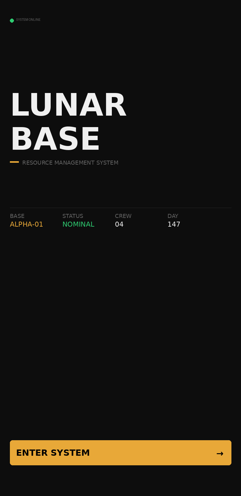
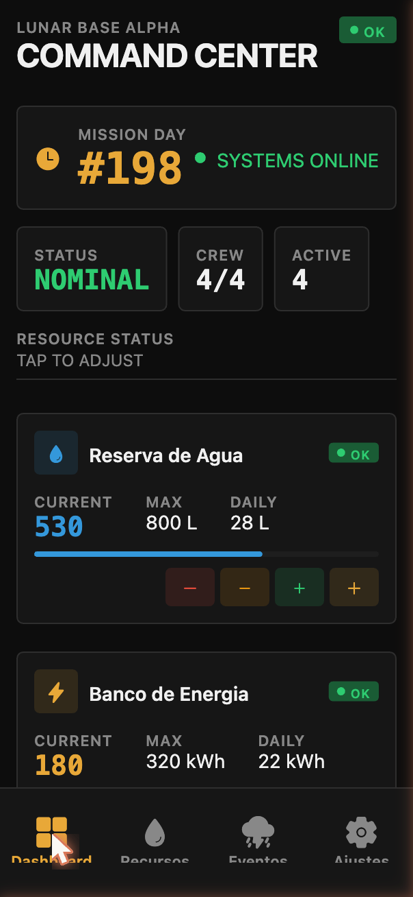
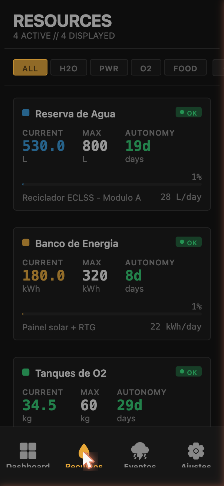
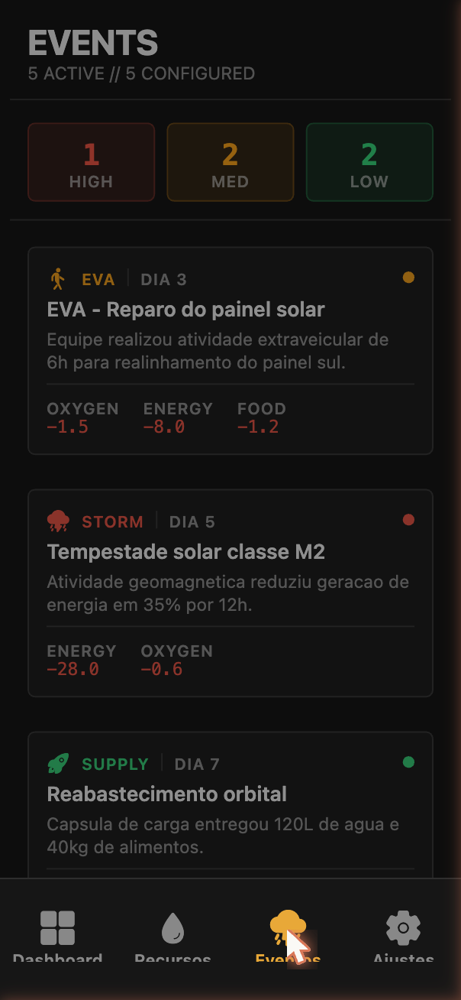
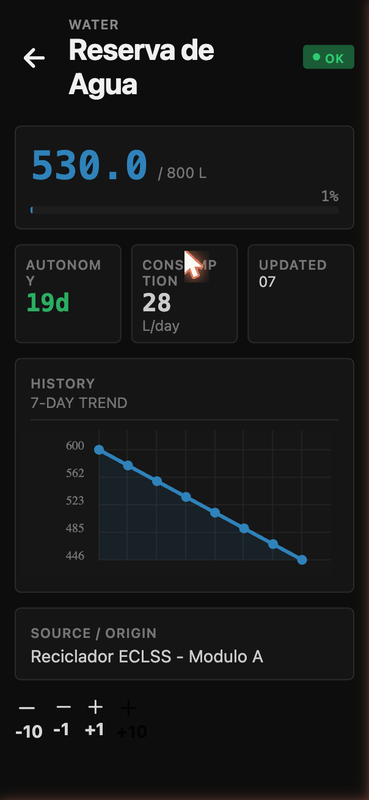
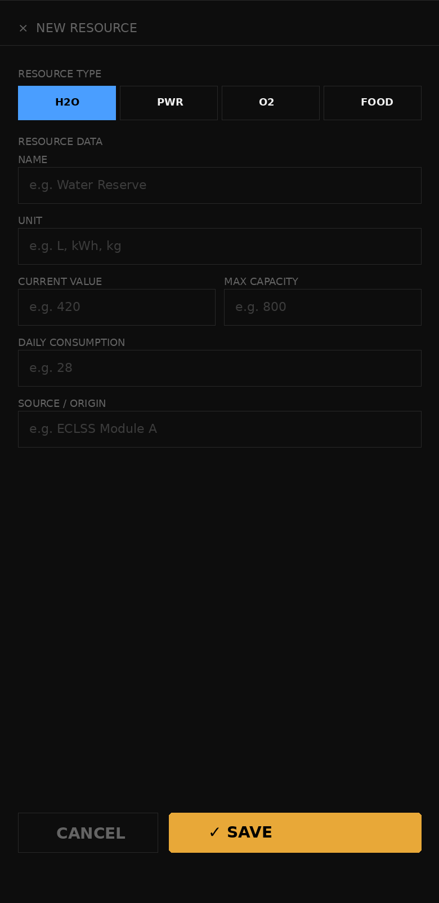
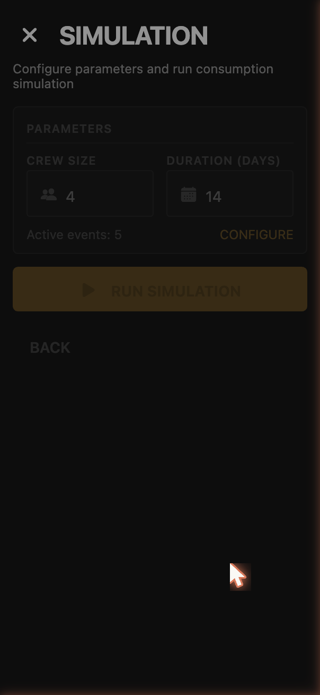
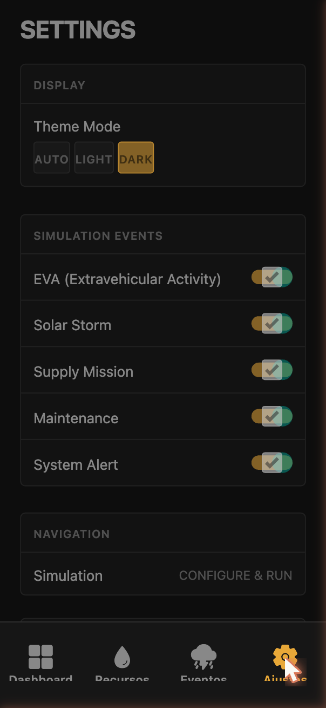

# LunarBase Resource Manager

Global Solution 2026.1 - Mobile Development & IoT
Engenharia de Software - 3o Ano
FIAP

## Descricao

Dashboard mobile em React Native + Expo (TypeScript) que simula a gestao de recursos vitais de uma base lunar. O sistema conecta as disciplinas da Global Solution em um projeto unico e integrado, demonstrando o monitoramento e controle de agua, energia, oxigenio e alimentos em um ambiente lunar.

Vertente: Sistemas autonomos e robotica para exploracao espacial.

Conexao com ODS da ONU: ODS 9 (Industria, Inovacao e Infraestrutura) / ODS 13 (Acao Climatica).

## Estrutura do Projeto

```
LunarBase-Resource-Manager/
|-- app/                          # Expo Router (navegacao por arquivo)
|   |-- _layout.tsx               # Root layout com providers (Theme, Resources, Simulation)
|   |-- index.tsx                 # Tela splash/home com animacao
|   |-- (tabs)/                   # Navegacao por abas
|   |   |-- _layout.tsx           # Tab navigator
|   |   |-- dashboard.tsx          # Command center interativo
|   |   |-- resources.tsx         # Lista de recursos com filtros
|   |   |-- events.tsx            # Eventos lunares (EVA, tempestade solar, etc.)
|   |   |-- settings.tsx          # Ajustes, tema e configuracao
|   |-- resource/
|   |   |-- [id].tsx              # Detalhe de recurso com +/- e grafico
|   |   |-- new.tsx               # Formulario de novo recurso com validacao
|   |-- simulation/
|   |   |-- index.tsx             # Simulacao de consumo dia a dia
|   |-- space/
|       |-- index.tsx             # Dados reais da NASA APOD API
|-- src/
|   |-- components/               # 12 componentes reutilizaveis
|   |-- context/                  # ThemeContext, ResourcesContext, SimulationContext, SpaceWeatherContext, ApiContext
|   |-- hooks/                    # useAsyncStorage, useResourceStats, useSpaceWeather
|   |-- services/                 # AsyncStorage + NASA API + SOA API services
|   |-- data/                     # Mock data com recursos e eventos lunares
|   |-- types/                    # Tipagens TypeScript completas
|   |-- theme/                    # Paleta de cores espaciais (dark/light)
|   |-- utils/                    # Logica de criticidade e formatacao
|-- assets/                      # Icones e splash com tema espacial
```

## Funcionalidades Implementadas

| Recurso | Descricao |
|---|---|
| Expo Router | 9 telas com navegacao stack + tabs |
| useState / useEffect | Gerenciamento de estado em todas as telas |
| Context API | ThemeContext, ResourcesContext, SimulationContext |
| AsyncStorage | Persistencia de tema, recursos e configuracao de simulacao |
| Formulario com validacao | NewResourceScreen com validacao completa |
| Dashboards com graficos | Dashboard + ResourceDetail com LineChart |
| Componentizacao | 12 componentes reutilizaveis |
| Tema dinamico (dark/light) | Toggle automatico com persistencia |
| TypeScript | Projeto 100% tipado |
| Animações | Focus-triggered em todas as telas |
| NASA APOD API | Dados reais de astronomia (diferencial) |
| SOA Web Services | 6 microservicos REST integrados ao app mobile |

## Screens

<table>
<tr>
<td align="center"><strong>Home / Splash</strong><br/><br/>Título dramático, status da base e botão Enter System</td>
<td align="center"><strong>Dashboard</strong><br/><br/>Command Center com dia de missão, recursos e ajuste rápido</td>
<td align="center"><strong>Recursos</strong><br/><br/>Lista com filtros por tipo, autonomia e consumo diário</td>
</tr>
<tr>
<td align="center"><strong>Eventos</strong><br/><br/>Log de missão: EVA, tempestades, reabastecimento e alertas</td>
<td align="center"><strong>Detalhe de Recurso</strong><br/><br/>Número em destaque, histórico 7 dias e botões de ajuste</td>
<td align="center"><strong>Novo Recurso</strong><br/><br/>Formulário com seleção de tipo e validação de campos</td>
</tr>
<tr>
<td align="center"><strong>Simulação</strong><br/><br/>Projeção dia-a-dia com crew, duração e impactos ambientais</td>
<td align="center"><strong>Ajustes</strong><br/><br/>Tema, toggles de eventos, SOA web services e reset de dados</td>
<td></td>
</tr>
</table>

## Instalacao e Execucao

### Pre-requisitos
- Node.js 18+
- npm ou pnpm
- Expo Go (Android/iOS) ou emulador
- .NET 8 SDK (para executar web services localmente)

### Passos

```bash
# Clonar o repositorio
git clone https://github.com/FelipemarquesdeOliveira/LunarBase-Resource-Manager.git
cd LunarBase-Resource-Manager

# Instalar dependencias
npm install

# Executar em modo de desenvolvimento
npx expo start

# Limpar cache se necessario
npx expo start --clear
```

### Integracao com Web Services (SOA)

Este projeto mobile foi desenvolvido em conjunto com um projeto de SOA (Architecture Oriented to Services) da FIAP. Os web services gerenciam a telemetria, recursos, simulacao e eventos da base lunar.

```bash
# Repositorio dos Web Services
git clone https://github.com/FelipemarquesdeOliveira/GS-SOA-WebServices.git
cd GS-SOA-WebServices/src

# Executar servicos (exemplo ResourceService)
cd ResourceService && dotnet run
```

**Microservicos disponiveis:**
- `ResourceService` - gestao de recursos (porta 5001)
- `SimulationService` - simulacao de consumo (porta 5002)
- `EventService` - eventos e alertas (porta 5003)
- `TelemetryService` - telemetria em tempo real (porta 5004)
- `SpaceIntegrationService` - dados espaciais (porta 5005)
- `CrewService` - gestao de tripulacao (porta 5006)

**Configuracao da API:**
No app, va em Ajustes > Configuracao da API e informe a URL base (ex: `http://localhost:5000`). O app alterna automaticamente entre modo offline (dados locais) e modo online (web services).

### Expo Go (QR Code)
1. Instale o app Expo Go no celular
2. Escaneie o QR Code gerado pelo npx expo start
3. O app carregara com hot-reload

## Tecnologias

- React Native + Expo SDK 53
- TypeScript (strict mode)
- Expo Router (file-based routing)
- react-native-chart-kit (graficos)
- react-native-reanimated (animacoes)
- @react-native-async-storage/async-storage (persistencia)
- React Native SVG
- NASA Open APIs (diferencial)

## Integrantes

- Felipe Marques de Oliveira | RM: 556319
- Gabriel Barros Cisoto | RM: 556309

## Professor

Prof. Hercules Ramos
Disciplina: Mobile Development & IoT - Global Solution 2026.1
FIAP - Todos os direitos reservados